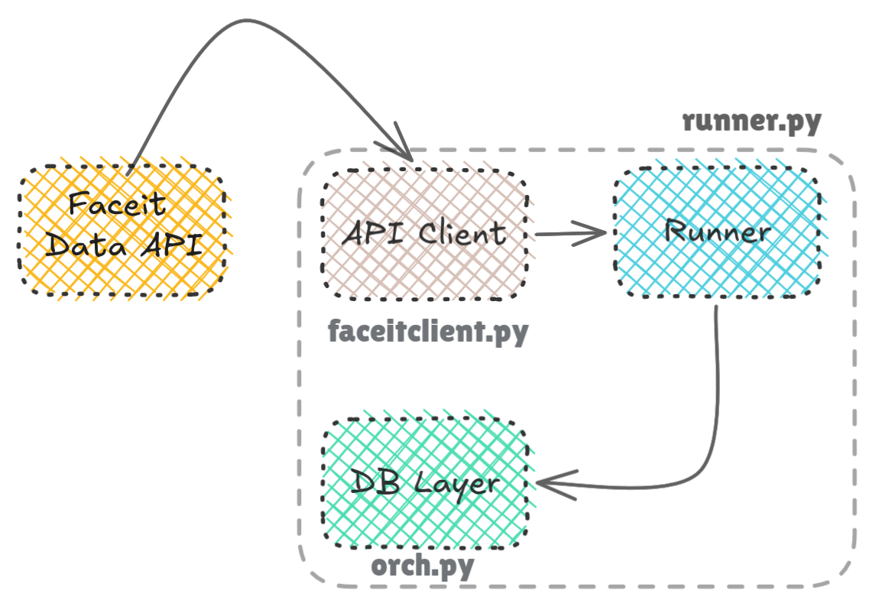
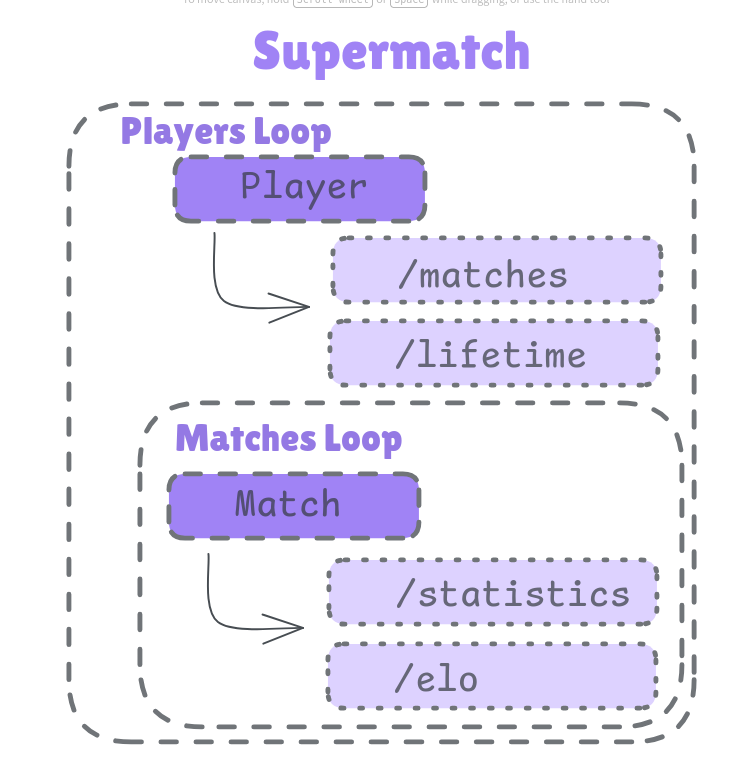
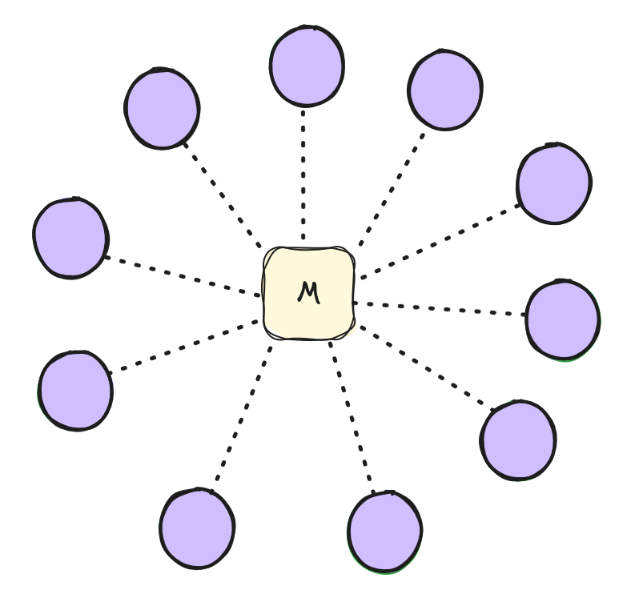
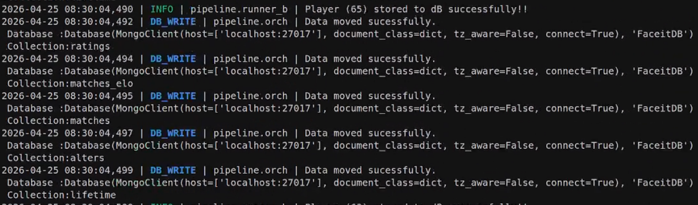

# Faceit AI Predictor

**Version:** v1.1.0

A Chrome extension backed by a machine learning model that predicts map win probabilities during the veto phase of a Faceit match.

The goal is to help competitive players make better map nominations against the specific set of 5 opponents they are facing, based on recent match data rather than lifetime averages.

---

## Current State

| Component | Status |
|---|---|
| Data ingestion pipeline | Complete |
| Async refactor | Complete |
| Feature engineering | In progress |
| Model training | Pending |
| Chrome extension inference | Pending |

---

## System Pipeline

```
Faceit Data API
      ↓
faceitclient.py  (API Client)
      ↓
runner.py  (Pipeline Runner)
      ↓
orch.py  (DB Layer)
      ↓
MongoDB
      ↓
Feature Engineering
      ↓
Model Training
      ↓
Chrome Extension Inference
```

---

## Architecture

The pipeline is split into three independent layers.

**API Client** `faceitclient.py`
Handles all communication with the Faceit Data API. Contains async fetch endpoints for matches, statistics, lifetime aggregates, and match elo. Each endpoint is individually wrapped with retry logic and observability tracking. Uses `aiohttp.ClientSession` for connection pooling.

**DB Layer** `orch.py`
Manages all MongoDB reads and writes. Handles bulk writes, duplicate detection, and collection-level error reporting. Collections: `matches`, `statistics`, `alters`, `players`, `matches_elo`, `lifetime`.

**Runner** `runner.py` / `runner_b.py`
Orchestrates the full pipeline. Manages async workers via nested `asyncio.Semaphore`, routes data through `asyncio.Queue` for producer-consumer batch processing, and handles checkpointing and graceful shutdown.

---

## Pipeline Workflow



The runner coordinates two stages of ego-centric sampling.

**Stage 1:** Process seed players (N), collect their matches and lifetime data.

**Stage 2:** Expand the network using alters discovered from Stage 1 matches.

Each player is processed as an isolated async task. The outer semaphore controls concurrent players. The inner semaphore controls per-player API calls. Data is produced into a queue and consumed by the batch processor, which writes to MongoDB once it hits the batch threshold.

---

## Async Workers



Two inner loops run per player.

**Players Loop:** Fetches `/matches` and `/lifetime` per player.

**Matches Loop:** Fetches `/statistics` and `/match_elo` per match.

Worker configuration: 6 outer workers, 3 inner workers. 18 API calls in flight at any time, eliminating rate limits across both stages.

---

## Data Collection Strategy

Ego-centric probabilistic sampling.

Snowball sampling from a single handpicked seed set would bias the dataset toward a narrow population. Ego-centric sampling seeds from a set of known high-elo players and expands through their match networks, introducing randomness at each layer via the match randomizer.



| Parameter | Value |
|---|---|
| Seed players (N) | ~2,076 |
| Matches sampled per player | 15, randomized from last 90 days |
| Alters (Stage 2) | ~80,959 |
| Lifetime IDs | ~61,862 |

`match_randomizer()` performs a MongoDB lookup before sampling to skip matches already in the database, reducing redundant API calls and keeping network expansion clean.

---

## Current Dataset

| Metric | Value |
|---|---|
| Total matches collected | 369K+ |
| Total collections combined | 1.5M+ |
| Data size | 3.5GB+ |
| Stage 1 DB writes | 78.4K |
| Duplicate writes | 12 |

---

## Performance

The async refactor reduced pipeline runtime by **5.3x** over the previous synchronous implementation.

Benchmark was taken at 650 seed players with 15 matches per player.

| | Sync | Async |
|---|---|---|
| 650 players (benchmark) | 2.2 hrs | 26 min |
| Stage 1 full, 2,076 players, 15 matches per alter | ~7 hrs (est.) | ~83 min (est.) |
| Stage 2 full, 61,862 players, 5 matches per alter | ~90 hrs (est.) | ~17 hrs (est.) |

Stage 2 makes 14 API calls per player versus 34 in Stage 1, due to the reduced match sample size of 5 per alter. Estimates are scaled proportionally from the benchmark.

---

## Observability

Every pipeline run produces:

- `logs/pipeline.log` — INFO level. Player writes, batch completions, stage progress.
- `logs/pipeline_debug.log` — DEBUG level. Every MongoDB heartbeat, API request and response, data accepted and rejected.

A JSON metrics file is saved per run covering RPM, average latency per endpoint, retry counts, and total execution time.

---

## Checkpointing

Earlier versions used index-based checkpointing stored on disk. The current implementation performs a MongoDB aggregation lookup at startup to identify unprocessed players based on the active stage. No state is stored on disk. The pipeline prompts with remaining player counts before execution begins.

---

## Batch Processing

The batch processor runs as an async consumer on `asyncio.Queue`. Producers (async workers) put data into the queue. Once the batch threshold is met, the processor writes all collections to MongoDB and clears the batch. Each batch is assigned an incremental batch ID logged on completion.

---

## Data Lineage

Every document stored in MongoDB carries a `stageId` field with the format `stage_{n}_{timestamp}`. This tracks which stage produced the data and when, independently of when it was stored.

---

## Prediction Design

**Model objective:**

```
P(win | map, context)
```

Where context includes team statistics, recent map performance, and historical patterns. The model outputs conditional win probabilities for each map in the veto pool.

**Performance metric:** Brier Score.

This is not a recommender system or a learning-to-rank model. It predicts win probabilities for a specific match context.

---

## Project Structure

```
faceit-ai/
├── configs/
│   ├── exceptions.py
│   └── logging_config.py
├── logs/
│   ├── pipeline.log
│   └── pipeline_debug.log
├── main.py
└── pipeline/
    ├── faceitclient.py
    ├── orch.py
    ├── runner.py
    ├── runner_b.py
    └── imgs/
         ├── dbwrite.png
         ├── expansion.png
         ├── pwf.jpeg
         ├── supermatch.png
         └── workflow.png

```

---



## What's Next

- Feature engineering from collected dataset
- Model training and evaluation
- Chrome extension inference integration