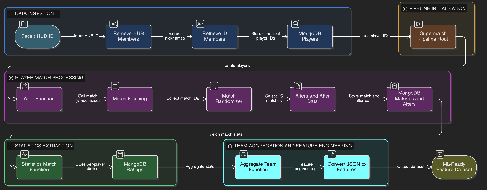

## Ingestion and Orchestration

**This Folder holds the modules required for data collection, ingesting them and orchestrating the workflow**

    - Ingestion steps
    - Orchestration Logic
    - Database collections

pipeline/ 
 ├── faceitclient.py class for Faceit API Client, i.e. match, retrieve_ID_members
 ├── orch.py MongoDB Ingestion pipeline
 ├── runner.py Class for the runner script for collecting data in batches

### Workflow Diagram


## Function documentation

### Retrieve Hub Members (`retrieve_hub_members`)

*Fetches all members of a Faceit hub, paginated, extracts only the fields you care about, and checkpoints them to CSV.*

**Step-by-step**

- Builds the Faceit hub members endpoint
- Paginates using offset + limit

**For each page:**

- Calls the API
- Iterates over the response payload

**Extracts:**

- user_id → renamed to _id
- nickname
- faceit_url

*Appends each user to players_list*

**When pagination ends:**

- Saves a CSV checkpoint (checkpoint_members.csv)
- Returns the full list of players
- Why it exists in the pipeline

**Why it exists**:
This gives the universe of players the pipeline needs.

### Retrive ID Members (`retrieve_ID_members`)

*Converts Faceit nicknames → Faceit player IDs.*

**Step-by-step**

- Loops over each nickname
- Calls the Faceit players endpoint
- Extracts player_id
- Appends it to id_list
- Returns all player IDs

**Why it exists**:
Some Faceit endpoints require player_id, not nickname. This function helps provide that

### Alter Function (`alter_function`)

**For one player:**

- Pulls their recent matches
- Randomly samples matches
- Extracts alters (other players in those matches)
- Stores everything in MongoDB

**Step-by-step**

- Calls match(..., randomized=True)

**gets:**

- alters: match → player_ids
- alter_data: raw match metadata

**If**, not enough matches (<15), skip player

**Otherwise:**

- Store raw matches in matches collection
- Store alters in alters collection
- Returns True or False depending on success

**Why it exists**:
This builds the player interaction graph, players obtained from matches.

### Match Randomizer (`match_randomizer`)

*Randomly selects 15 matches from a player’s recent match history, reproducibly.*

**Step-by-step**

- Seeds NumPy RNG
- Indexes match IDs
- Randomly samples 15 unique indices
- Maps them back to match IDs
- Returns a set of sampled match IDs

**Why it exists**:
Controls data leakage + bias, to avoid “most recent only” or order-dependent samples.

### Collect N (`collect_N`)

*Fetches all player IDs already stored in MongoDB.*

**Step-by-step**

- Queries players collection
- Extracts _id field
- Returns a list of player IDs
- Why it exists

**Why it exists**:
Lets the pipeline resume from stored state of N players.

### Supermatch (`supermatch`)

*Pipeline Orchestrator - Runs the entire pipeline end-to-end.*

**Step-by-step**

- Connects to MongoDB
- Loads all player IDs
- For each player:
   - Calls alter_function
   - Stores matches + alters
   - Sleeps to avoid rate limits

- Fetches all stored match IDs
- For each match:
    - Calls statistics_match_func
    - Stores player-level stats in ratings

**Why it exists**:
This acts like DAG rote nood,
everything fans out from here.

### Statistics Match Function (`statistics_match_func`)

*Fetches per-player statistics for a single match.*

**Step-by-step**

- Calls Faceit match statistics endpoint
- Iterates through:
    - rounds → teams → players

- Collects all player stat blobs
- Returns:

```{
  "_id": match_id,
  "players": [...]
}
```


**Why it exists**:
This is the feature ingestion layer
This feeds the ML side later.

### Match (`match`)

*Fetches recent match history for a player and optionally samples it.*

**Step-by-step**

- Queries match history (last 40 days)
- Paginates using offset
- Extracts:
    - match_id
    - playing_players
- Stores raw match metadata
- If randomized=False:
    - Returns all matches

- If randomized=True:
    - Calls match_randomizer
    - Filters matches
    - Returns:
        - alters (match → players)
        - alter_data (raw matches)

**Why it exists**:
This is the backbone of the pipeline, 
almost everything depends on this function.

### Convert JSON (`convert_json`)

*Aggregates player stats numerically using Polars.*

**Step-by-step**

- Converts list of dicts → Polars DataFrame
- Casts all columns to float
- Computes column-wise mean
- Returns result as a Python dict

**Why it exists**:
Turns raw per-player stats into team-level features

### Aggregate Team Function (`agg_team_func`)

*Computes team-level aggregate statistics for each match.*

**Step-by-step**

- Iterates through rounds and teams
- Separates players into:
    - faction1
    - faction2
- Aggregates stats using convert_json
- Appends aggregated stats back into match structure

**Why it exists**:
This is the feature engineering step, intended for ML purposes.

**Note:** All functions mentioned in the markdown are **lowercase.**